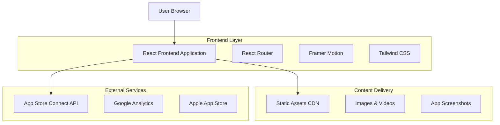
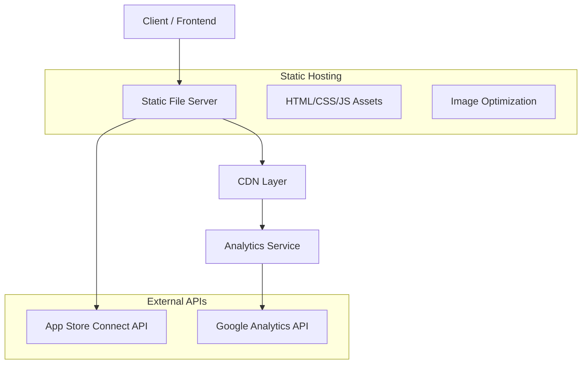
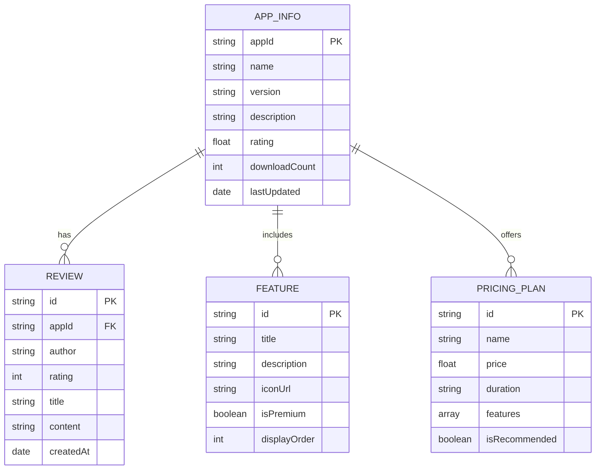

# SoulCards 推廣網站技術架構文檔

## 1. Architecture design



## 2. Technology Description

* Frontend: React\@18 + TypeScript + Vite + Tailwind CSS\@3 + Framer Motion

* Styling: Tailwind CSS with custom mystical theme configuration

* Animation: Framer Motion for smooth transitions and particle effects

* Routing: React Router DOM for single-page application navigation

* Build Tool: Vite for fast development and optimized production builds

* Deployment: Static hosting (Vercel/Netlify) with CDN integration

## 3. Route definitions

| Route     | Purpose                  |
| --------- | ------------------------ |
| /         | 首頁，展示應用主要特色和下載引導         |
| /features | 功能介紹頁，詳細展示應用功能和技術優勢      |
| /pricing  | 訂閱方案頁，展示價格對比和 Premium 功能 |
| /privacy  | 隱私政策頁，說明數據收集和處理政策        |
| /terms    | 服務條款頁，應用使用協議和法律條款        |
| /about    | 關於我們頁，團隊介紹和聯繫方式          |

## 4. API definitions

### 4.1 Core API

App Store 評分和評價獲取

```
GET /api/app-store/reviews
```

Response:

| Param Name | Param Type | Description  |
| ---------- | ---------- | ------------ |
| rating     | number     | 應用平均評分 (1-5) |
| reviews    | array      | 用戶評價列表       |
| totalCount | number     | 總評價數量        |

Example Response:

```json
{
  "rating": 4.8,
  "totalCount": 1250,
  "reviews": [
    {
      "id": "review_1",
      "author": "神秘占卜師",
      "rating": 5,
      "title": "非常準確的塔羅占卜",
      "content": "AI 解讀很專業，界面設計很美",
      "date": "2024-01-15"
    }
  ]
}
```

應用下載統計

```
GET /api/app-store/stats
```

Response:

| Param Name   | Param Type | Description |
| ------------ | ---------- | ----------- |
| downloads    | number     | 總下載次數       |
| activeUsers  | number     | 活躍用戶數       |
| premiumUsers | number     | Premium 用戶數 |

## 5. Server architecture diagram



## 6. Data model

### 6.1 Data model definition



### 6.2 Data Definition Language

由於這是一個靜態推廣網站，主要數據將以 JSON 配置文件形式存儲：

應用基本信息 (appInfo.json)

```json
{
  "appId": "com.soulcards.ios",
  "name": "SoulCards - 塔羅占卜",
  "version": "1.0.0",
  "description": "優雅的iOS塔羅牌占卜應用，提供神秘的塔羅牌解讀體驗",
  "rating": 4.8,
  "downloadCount": 10000,
  "appStoreUrl": "https://apps.apple.com/app/soulcards/id123456789",
  "lastUpdated": "2024-01-15T00:00:00Z"
}
```

功能特色配置 (features.json)

```json
[
  {
    "id": "tarot_reading",
    "title": "神秘塔羅占卜",
    "description": "支持多種占卜方式，包含78張精美塔羅牌",
    "iconUrl": "/icons/tarot-cards.svg",
    "isPremium": false,
    "displayOrder": 1
  },
  {
    "id": "ai_interpretation",
    "title": "AI智能解讀",
    "description": "集成OpenRouter + Google Gemini API提供深度分析",
    "iconUrl": "/icons/ai-brain.svg",
    "isPremium": true,
    "displayOrder": 2
  }
]
```

訂閱方案配置 (pricing.json)

```json
[
  {
    "id": "monthly",
    "name": "月度訂閱",
    "price": HK$38,
    "duration": "月",
    "features": ["無限占卜", "AI深度解讀", "歷史記錄", "分享占卜記錄"],
    "isRecommended": true
  },
  {
    "id": "yearly",
    "name": "年度訂閱",
    "price": HK$368,
    "duration": "年",
    "features": ["無限占卜", "AI深度解讀", "歷史記錄", "PDF導出", "優先客服"],
    "isRecommended": false
  }
]
```

