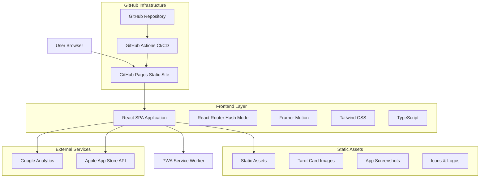
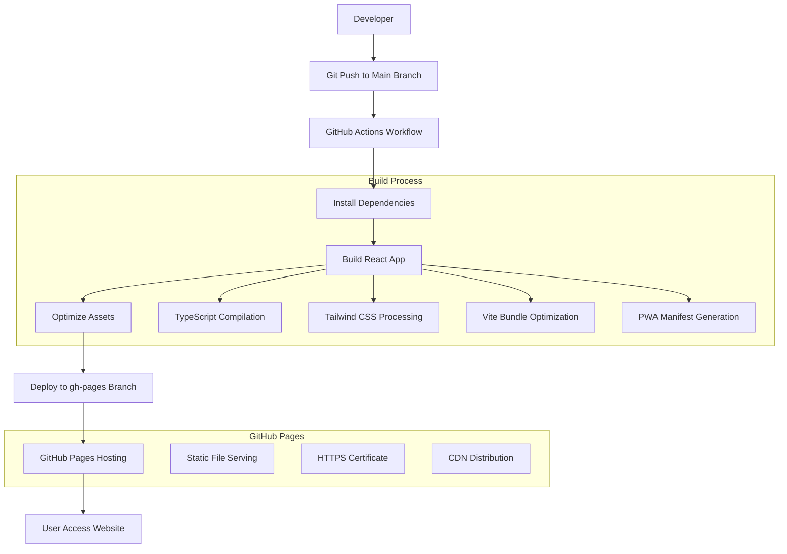

# SoulCards 推廣網站技術架構文檔

## 1. Architecture design



## 2. Technology Description

* **Frontend**: React@18 + TypeScript + Vite + Tailwind CSS@3 + Framer Motion
* **Styling**: Tailwind CSS with custom mystical theme configuration
* **Animation**: Framer Motion for smooth transitions and particle effects  
* **Routing**: React Router DOM with Hash Router (GitHub Pages compatible)
* **Build Tool**: Vite with GitHub Pages optimization
* **PWA**: Service Worker for offline support and app-like experience
* **SEO**: React Helmet for meta tags and Open Graph optimization
* **Deployment**: GitHub Pages with GitHub Actions automated deployment
* **Performance**: Code splitting, lazy loading, and image optimization

## 3. Route definitions

| Route       | Purpose                                    | GitHub Pages URL                    |
| ----------- | ------------------------------------------ | ----------------------------------- |
| /#/         | 首頁，展示應用主要特色和下載引導                       | /SoulCards_Website/#/               |
| /#/features | 功能介紹頁，詳細展示應用功能和技術優勢                    | /SoulCards_Website/#/features       |
| /#/pricing  | 訂閱方案頁，展示價格對比和 Premium 功能               | /SoulCards_Website/#/pricing        |
| /#/privacy  | 隱私政策頁，說明數據收集和處理政策                      | /SoulCards_Website/#/privacy        |
| /#/terms    | 服務條款頁，應用使用協議和法律條款                      | /SoulCards_Website/#/terms          |
| /#/about    | 關於我們頁，團隊介紹和聯繫方式                        | /SoulCards_Website/#/about          |

**注意**: 使用 Hash Router 確保在 GitHub Pages 上所有路由都能正常工作，避免 404 錯誤。

## 4. API definitions

### 4.1 Core API

App Store 評分和評價獲取

```
GET /api/app-store/reviews
```

Response:

| Param Name | Param Type | Description  |
| ---------- | ---------- | ------------ |
| rating     | number     | 應用平均評分 (1-5) |
| reviews    | array      | 用戶評價列表       |
| totalCount | number     | 總評價數量        |

Example Response:

```json
{
  "rating": 4.8,
  "totalCount": 1250,
  "reviews": [
    {
      "id": "review_1",
      "author": "神秘占卜師",
      "rating": 5,
      "title": "非常準確的塔羅占卜",
      "content": "AI 解讀很專業，界面設計很美",
      "date": "2024-01-15"
    }
  ]
}
```

應用下載統計

```
GET /api/app-store/stats
```

Response:

| Param Name   | Param Type | Description |
| ------------ | ---------- | ----------- |
| downloads    | number     | 總下載次數       |
| activeUsers  | number     | 活躍用戶數       |
| premiumUsers | number     | Premium 用戶數 |

## 5. GitHub Pages 部署架構



## 6. 項目配置和部署設定

### 6.1 GitHub Actions 工作流程

```yaml
# .github/workflows/deploy.yml
name: Deploy to GitHub Pages

on:
  push:
    branches: [ main ]
  pull_request:
    branches: [ main ]

jobs:
  build-and-deploy:
    runs-on: ubuntu-latest
    
    steps:
    - name: Checkout
      uses: actions/checkout@v4
      
    - name: Setup Node.js
      uses: actions/setup-node@v4
      with:
        node-version: '18'
        cache: 'npm'
        
    - name: Install dependencies
      run: npm ci
      
    - name: Build
      run: npm run build
      env:
        NODE_ENV: production
        
    - name: Deploy to GitHub Pages
      uses: peaceiris/actions-gh-pages@v3
      if: github.ref == 'refs/heads/main'
      with:
        github_token: ${{ secrets.GITHUB_TOKEN }}
        publish_dir: ./dist
```

### 6.2 Vite 配置優化

```typescript
// vite.config.ts
import { defineConfig } from 'vite'
import react from '@vitejs/plugin-react'
import { VitePWA } from 'vite-plugin-pwa'

export default defineConfig({
  plugins: [
    react(),
    VitePWA({
      registerType: 'autoUpdate',
      workbox: {
        globPatterns: ['**/*.{js,css,html,ico,png,svg,jpg,jpeg}']
      },
      manifest: {
        name: 'SoulCards - 塔羅占卜',
        short_name: 'SoulCards',
        description: '優雅的iOS塔羅牌占卜應用推廣網站',
        theme_color: '#663399',
        background_color: '#0D0A1A',
        display: 'standalone',
        icons: [
          {
            src: 'icon-192.png',
            sizes: '192x192',
            type: 'image/png'
          }
        ]
      }
    })
  ],
  base: '/SoulCards_Website/',
  build: {
    outDir: 'dist',
    assetsDir: 'assets',
    rollupOptions: {
      output: {
        manualChunks: {
          vendor: ['react', 'react-dom'],
          animations: ['framer-motion']
        }
      }
    }
  },
  optimizeDeps: {
    include: ['react', 'react-dom', 'framer-motion']
  }
})
```

### 6.3 靜態數據配置

應用基本信息 (src/data/appInfo.json)

```json
{
  "appId": "com.soulcards.ios",
  "name": "SoulCards - 塔羅占卜",
  "version": "1.0.0",
  "description": "優雅的iOS塔羅牌占卜應用，提供神秘的塔羅牌解讀體驗",
  "rating": 4.8,
  "downloadCount": 10000,
  "appStoreUrl": "https://apps.apple.com/app/soulcards/id123456789",
  "lastUpdated": "2024-01-15T00:00:00Z"
}
```

功能特色配置 (src/data/features.json)

```json
[
  {
    "id": "tarot_reading",
    "title": "神秘塔羅占卜",
    "description": "支持多種占卜方式，包含78張精美塔羅牌",
    "iconUrl": "/assets/icons/tarot-cards.svg",
    "isPremium": false,
    "displayOrder": 1
  },
  {
    "id": "ai_interpretation", 
    "title": "AI智能解讀",
    "description": "集成OpenRouter + Google Gemini API提供深度分析",
    "iconUrl": "/assets/icons/ai-brain.svg",
    "isPremium": true,
    "displayOrder": 2
  }
]
```

### 6.4 SEO 和性能優化配置

```typescript
// src/utils/seo.ts
export const seoConfig = {
  title: 'SoulCards - 神秘塔羅占卜應用',
  description: '探索你的內心世界，發現生命的奧秘。SoulCards 提供專業的塔羅牌占卜體驗，配備AI智能解讀功能。',
  keywords: '塔羅牌,占卜,AI解讀,神秘學,iOS應用',
  ogImage: '/assets/images/og-image.jpg',
  twitterCard: 'summary_large_image',
  canonicalUrl: 'https://username.github.io/SoulCards_Website/'
}
```

