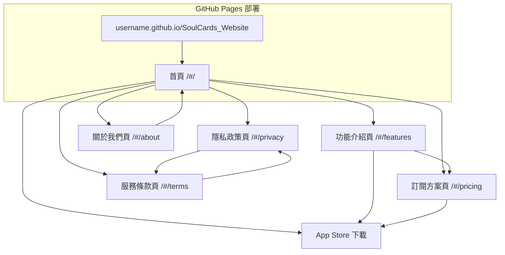

# SoulCards 推廣網站產品需求文檔

## 1. Product Overview

SoulCards 推廣網站是一個專為 iOS 塔羅占卜應用程式設計的官方推廣平台，旨在展示應用程式的神秘魅力和強大功能。
網站採用與 iOS 應用相同的神秘主題設計風格，通過優雅的視覺呈現和流暢的用戶體驗，引導潛在用戶了解並下載 SoulCards 應用程式，最終提升訂閱轉換率和品牌知名度。

**部署目標**: 網站將部署到 GitHub Pages，提供免費、穩定的靜態網站託管服務，支援自動化部署和 HTTPS 安全連接。

## 2. Core Features

### 2.1 User Roles

| Role | Registration Method | Core Permissions |
|------|---------------------|------------------|
| 訪客用戶 | 無需註冊 | 瀏覽所有頁面內容、查看應用介紹、訪問下載連結 |

### 2.2 Feature Module

我們的 SoulCards 推廣網站包含以下主要頁面：

1. **首頁**：英雄區塊、應用特色展示、用戶評價、下載引導
2. **功能介紹頁**：詳細功能說明、截圖展示、AI 解讀演示
3. **訂閱方案頁**：價格展示、功能對比、優勢說明
4. **隱私政策頁**：數據收集說明、使用條款、用戶權利
5. **服務條款頁**：使用協議、責任聲明、法律條款
6. **關於我們頁**：團隊介紹、開發理念、聯繫方式

### 2.3 Page Details

| Page Name | Module Name | Feature description |
|-----------|-------------|---------------------|
| 首頁 | 英雄區塊 | 展示應用程式主視覺、核心價值主張、立即下載按鈕，包含動態星空背景和光暈效果 |
| 首頁 | 功能特色區 | 展示 6 大核心功能：神秘塔羅占卜、AI 智能解讀、精美卡牌設計、流暢動畫、Premium 訂閱、數據同步 |
| 首頁 | 應用截圖展示 | 輪播展示應用程式界面截圖，包含占卜界面、卡牌展示、結果頁面等 |
| 首頁 | 用戶評價區 | 展示 App Store 真實用戶評價和評分，增加可信度 |
| 首頁 | 下載引導區 | 突出的 App Store 下載按鈕、QR Code、支持設備說明 |
| 功能介紹頁 | 詳細功能說明 | 深入介紹塔羅占卜系統、AI 解讀技術、78 張塔羅牌數據庫 |
| 功能介紹頁 | 互動演示區 | 模擬占卜流程演示、卡牌翻轉動畫、解讀結果展示 |
| 功能介紹頁 | 技術優勢 | 展示 OpenRouter AI、Supabase 後端、原生 iOS 技術優勢 |
| 訂閱方案頁 | 價格對比表 | 免費版 vs Premium 功能對比、月度/年度訂閱價格、優惠說明 |
| 訂閱方案頁 | 功能詳解 | Premium 專屬功能：無限占卜、高級解讀、歷史記錄、PDF 導出 |
| 訂閱方案頁 | 用戶見證 | Premium 用戶真實反饋和使用體驗分享 |
| 隱私政策頁 | 數據收集說明 | 詳細說明收集的用戶數據類型、收集目的、存儲方式 |
| 隱私政策頁 | 第三方服務 | 說明 Supabase、OpenRouter、Apple IAP 等第三方服務的數據處理 |
| 隱私政策頁 | 用戶權利 | 數據訪問、修改、刪除權利說明，聯繫方式 |
| 服務條款頁 | 使用協議 | 應用程式使用規則、用戶行為規範、禁止事項 |
| 服務條款頁 | 訂閱條款 | 自動續訂說明、取消政策、退款規則 |
| 服務條款頁 | 免責聲明 | 占卜結果僅供娛樂、不承擔決策責任等聲明 |
| 關於我們頁 | 團隊介紹 | 開發團隊背景、專業經驗、設計理念 |
| 關於我們頁 | 聯繫方式 | 客服郵箱、社交媒體、意見反饋渠道 |

## 3. Core Process

**主要用戶流程：**

用戶訪問網站 → 瀏覽首頁了解應用 → 查看功能介紹和截圖 → 了解訂閱方案 → 點擊下載按鈕跳轉 App Store → 下載並註冊應用 → 體驗免費功能 → 升級 Premium 訂閱

**頁面導航流程：**

## 4. User Interface Design

### 4.1 Design Style

- **主色調**：深紫色 (#663399)、神秘紫 (#4D1A80)
- **輔助色**：金色 (#FFD700)、星銀色 (#CCCCDD)、宇宙靛藍 (#4C0080)
- **按鈕風格**：圓角漸變按鈕，金色邊框，懸停光暈效果
- **字體**：主標題使用 32-48px 粗體，正文使用 16-18px 中等字重
- **佈局風格**：卡片式設計，頂部導航，星空背景，粒子動畫效果
- **圖標風格**：線性圖標配合神秘元素，如星星、月亮、水晶球等

### 4.2 Page Design Overview

| Page Name | Module Name | UI Elements |
|-----------|-------------|-------------|
| 首頁 | 英雄區塊 | 全屏星空背景漸變、中央應用 Logo、大標題文字、金色 CTA 按鈕、浮動粒子效果 |
| 首頁 | 功能特色區 | 6 個功能卡片網格佈局、每卡片包含圖標、標題、描述、懸停光暈效果 |
| 首頁 | 截圖展示 | 手機框架內的應用截圖輪播、左右切換按鈕、指示點、3D 傾斜效果 |
| 首頁 | 用戶評價 | 星級評分顯示、用戶頭像、評價文字、滑動卡片佈局 |
| 功能介紹頁 | 詳細說明 | 左右分欄佈局、文字說明配合動畫圖示、漸變分隔線 |
| 訂閱方案頁 | 價格表 | 3 欄對比表格、突出推薦方案、勾選圖標、金色邊框強調 |
| 隱私政策頁 | 內容區域 | 單欄文字佈局、章節導航、返回頂部按鈕、深色卡片背景 |

### 4.3 Responsiveness

網站採用移動優先的響應式設計，在桌面端提供完整體驗，在移動端優化觸控交互。主要斷點：768px（平板）、1024px（桌面），支持觸控手勢和懸停效果的適配。

### 4.4 GitHub Pages 優化特性

- **PWA 支持**: 支援離線瀏覽和應用程式安裝
- **SEO 優化**: 完整的 meta 標籤和 Open Graph 配置
- **性能優化**: 代碼分割、懶加載和圖片優化
- **自動部署**: GitHub Actions 自動化構建和部署
- **HTTPS 安全**: GitHub Pages 提供免費 SSL 證書
- **CDN 加速**: 全球內容分發網路提升載入速度